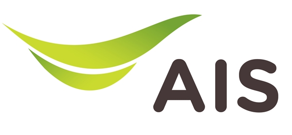

# ISP

**Internet load balancing** is defined as the method of splitting Internet traffic over 2 or more Internet connections to provide primarily two desired outcomes:

1. Better Internet and therefore end-user performance.
2. Increased reliability of the Internet connectivity

Reference: [Internet Load Balancing - What to look for in Internet load balancers](https://www.mushroomnetworks.com/blog/internet-load-balancing-what-to-look-for-in-internet-load-balancers/)

## [AIS](https://business.ais.co.th/pdf/AISCatalog2021.pdf) - Primary ISP

### Services and Outstanding features

#### Corporate Internet

* Reliable, high-speed internet for business
* On-demand bandwidth burst support for business seasoning&#x20;
* Nationwide coverage for all business
* 24/7 support for business continuity&#x20;

#### Corporate Wi-Fi

* Wi-Fi Access Point (AP) with corporate SSID name
* Customizable login portal included

#### SD-WAN Connectivity Service

* Full flexible for any connectivity media and any provider.
* Faster implementation and scaling
* Centralized network management and monitoring
* Improves network security policy management
* Professionally managed organization SD-WAN network

#### Hybrid MPLS

* 3G/4G connectivity backup for main network
* Full speed package at all times
* On 3G/4G largest bandwidth of AIS network
* Support 24/7 with SLA guaranteed

#### Bandwidth on Demand

* Network scalability for domestic and internet VPNs
* On-demand bandwidth flexibility up to 200 Mbps\*
* Ease of 4-step itself-service ordering portal
* Choice of one-time or monthly recurring schedule

#### Corporate fixed line

* DID phone number provided
* Cost saving from convergence with AIS mobile


Direct Inward Dialing (DID) is a telephone service that allows a phone number to ring through directly to a specific phone at a business instead of going to a menu or a queue and needing to dial an extension.

Reference: [Direct Inward Dialing (DID)](https://www.twilio.com/docs/glossary/what-direct-inward-dialing-did)


### Plan

| Monthly Service Fee | Max Speed (Download/Upload) | Add-ons                                              |
| ------------------- | --------------------------- | ---------------------------------------------------- |
| 1,099 Baht          | 1000/500 Mbps               | Public IPv4, WiFi Log, Office number with free calls |

Reference: [AIS-SME Brochure](https://business.ais.co.th/sme/download/SME2022.pdf)

## [UIH](https://www.uih.co.th/en/internet-solutions-vas/internet-solution/corporate-internet) - Secondary ISP

### UIH Corporate Internet

This internet service delivers maximum stability, faster connections, and greater efficiency. Customers are ultimately empowered when their branches enjoy convenient internet access over the UIH’s terabits-level fiber-optic network. As UIH’s infrastructure covers the whole Thailand, internet-based communications between the headquarters and branches of UIH’s Corporate Internet users will have no limits.

#### Outstanding features

* High stability from the fiber-optic network that boasts redundancy&#x20;
* Pre-sales and after-sales services by more than 100 highly-experienced engineers&#x20;
* Various optional services are available for customers to choose 24 hours a day, 365 days a year

#### Benefit

* There are various efficient add-on services to choose. Among them are Clean Mail (Premium Grade Anti-Spam & Anti-Virus), Content Filtering, and Centralized Firewall

### Plan

Contact UIH's customer service

* Telephone: +66 2016 5000
* E-Mail: info@uih.co.th
