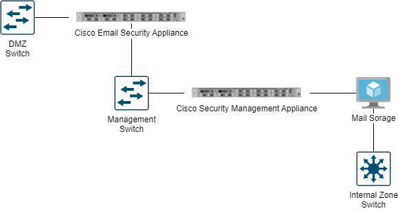

# Mail Server

### Diagram

### Cisco Email Security Appliance

[The Cisco Email Security Appliance](https://www.techtarget.com/searchsecurity/feature/Cisco-Email-Security-Appliance-Product-overview) is an email security gateway product. It is designed to detect and block a wide variety of email-borne threats, such as malware, spam and phishing attempts. Because so many of today's attacks occur through email messages, having an email security gateway has become a necessity for most organizations.

### Cisco Security Management Appliance

Centralize management and reporting functions across multiple Cisco Email Security Appliances (ESAs) with the [Cisco Content Security Management Appliance (SMA)](https://www.cisco.com/c/en/us/products/collateral/security/content-security-management-appliance/datasheet\_C78-721194.html). The integration of Cisco SMA with Cisco ESAs simplifies the planning and administration of email and web security, improves compliance monitoring, makes possible a consistent enforcement of acceptable-use policies, and enhances threat protection.
