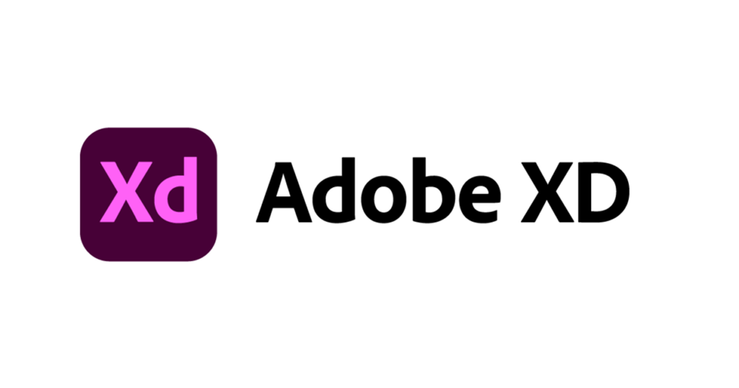

# Back-End

## Development Tools

### For Database Design

#### Diagrams.net (draw.io)

Diagrams.net (formerly draw.io) is free online diagram software. You can use it as a flowchart maker, network diagram software, to create UML online, as an ER diagram tool, to design database schema, to build BPMN online, as a circuit diagram maker, and more.

 (1) (1) (1) (1) (1).png>)

Reference:

* [https://app.diagrams.net/](https://app.diagrams.net)
* [https://snapcraft.io/install/drawio/mint](https://snapcraft.io/install/drawio/mint)

### For Database Management

#### Relational Database Service for MySQL (RDS for MySQL)

Relational Database Service for MySQL (RDS for MySQL) is a fully managed database service powered by the world’s most popular enterprise-grade open-source relational database system.

Reference:

* [https://www.huaweicloud.com/intl/en-us/product/mysql.html](https://www.huaweicloud.com/intl/en-us/product/mysql.html)

#### MySQL

MySQL is a relational database management system (RDBMS) developed by Oracle that is based on structured query language (SQL).

Reference:

* [https://www.talend.com/resources/what-is-mysql/](https://www.talend.com/resources/what-is-mysql/)
* [https://dev.classmethod.jp/articles/installing-mysql-8-in-amazon-linux-2/](https://dev.classmethod.jp/articles/installing-mysql-8-in-amazon-linux-2/)

#### SQL

SQL is a domain-specific language used in programming and designed for managing data held in a relational database management system (RDBMS), or for stream processing in a relational data stream management system (RDSMS).

.png>)

Reference:

* [https://en.wikipedia.org/wiki/SQL](https://en.wikipedia.org/wiki/SQL)
* [https://www.jalalmhz.ir/web-design-and-development/introduction-to-sql-database/2021/05/27/](https://www.jalalmhz.ir/web-design-and-development/introduction-to-sql-database/2021/05/27/)

#### PHP

PHP is a server scripting language, and a powerful tool for making dynamic and interactive Web pages.

.png>)

Reference:

* [https://www.w3schools.com/php/](https://www.w3schools.com/php/)
* [https://saixiii.com/what-is-php/](https://saixiii.com/what-is-php/)

