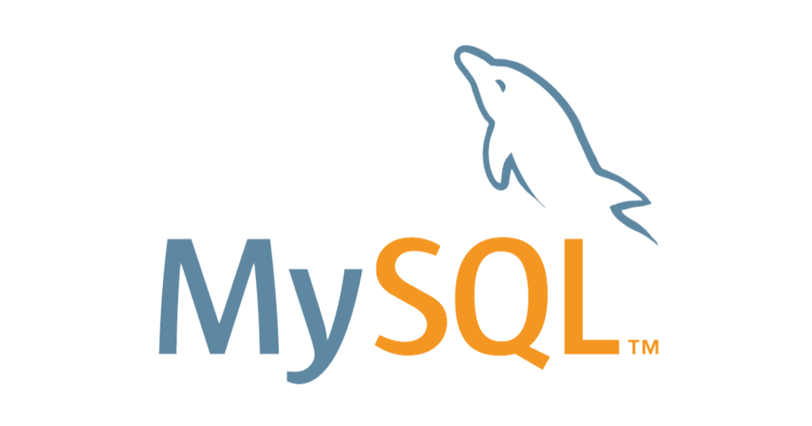

# Development Tools

### For User Interface Design

#### Adobe XD

Adobe XD helps you craft prototypes that look and feel like the real thing, so you can communicate your design vision and maintain alignment across your team efficiently. Adobe XD is a powerful and easy-to-use vector-based experience design platform that gives teams the tools they need to craft the world’s best experiences collaboratively. Available on Mac and Windows systems, XD meets teams where they’re working with cross-platform compatibility.

Reference: [What is Adobe XD and What is it Used for?](https://www.adobe.com/th\_en/products/xd/learn/get-started/what-is-adobe-xd-used-for.html)

### For Front-End Development

#### Visual Studio Code

Visual Studio Code combines the simplicity of a source code editor with powerful developer tooling, like IntelliSense code completion and debugging. First and foremost, it is an editor that gets out of your way. The delightfully frictionless edit-build-debug cycle means less time fiddling with your environment, and more time executing on your ideas. It supports macOS, Linux, and Windows.

 (1) (1).png>)

Reference: [Why Visual Studio Code?](https://code.visualstudio.com/docs/editor/whyvscode)

#### Bootstrap

Bootstrap is the most popular CSS Framework for developing responsive and mobile-first websites.

 (1).png>)

Reference: [What is Bootstrap (w3schools.com)](https://www.w3schools.com/whatis/whatis\_bootstrap.asp)
